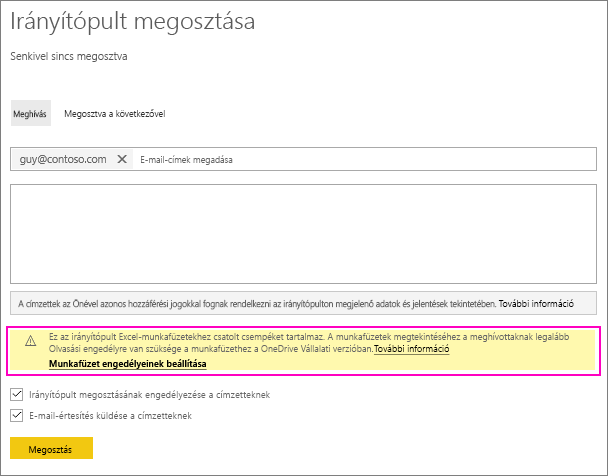
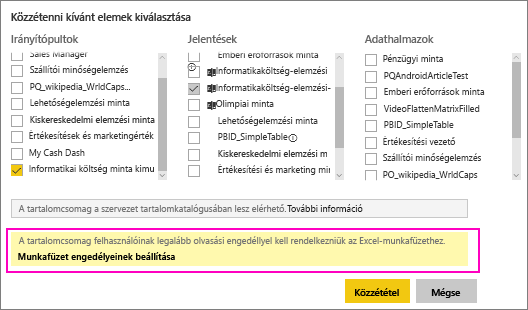
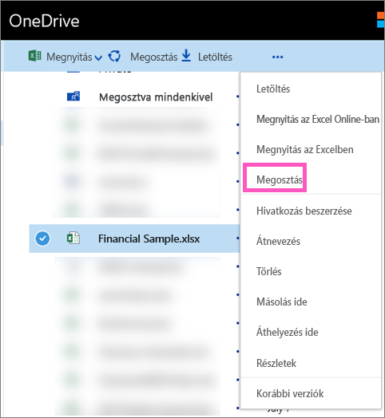

# OneDrive-on található Excel-fájlra hivatkozó Power BI-irányítópult megosztása
A Power BI-ból csatlakozhat a [OneDrive Vállalati verzióján tárolt Excel-munkafüzetekhez](service-excel-workbook-files.md), és a munkafüzetekből csempéket tűzhet ki az irányítópultokra. Ha megoszt egy ilyen irányítópultot, vagy létrehoz egy tartalomcsomagot, amely tartalmazza az irányítópultot:

* Kollégái akkor is megnézhetik a csempéket, ha nincs engedélyük a munkafüzethez. A tartalomcsomagokat annak tudatában hozhatja létre, hogy kollégái megtekinthetik a OneDrive-on található Excel-munkafüzetekből létrehozott csempéket.
* A csempékre kattintva a munkafüzet megnyitható a Power BI szolgáltatásban. A munkafüzet azonban csak akkor nyílik meg, ha munkatársainak legalább [olvasási jogosultsága](https://support.office.com/en-us/article/Share-documents-or-folders-in-Office-365-1fe37332-0f9a-4719-970e-d2578da4941c) van a OneDrive Vállalati verzióján tárolt munkafüzethez.

## Munkafüzetcsempéket tartalmazó irányítópult megosztása
A OneDrive Vállalati verzióban tárolt Excel-munkafüzetre hivatkozó irányítópultok megosztásával kapcsolatban tekintse át az [Irányítópultok megosztását](service-share-dashboards.md) bemutató cikket. A különbség csak annyi, hogy lehetősége van a hivatkozott Excel-munkafüzethez tartozó jogosultságok módosítására.

  

1. Adja meg kollégái e-mail-címét.
2. Az Excel-munkafüzet a Power BI szolgáltatásban történő megtekintésének az engedélyezéséhez kattintson a **Munkafüzet engedélyeinek beállítása** lehetőségre.
3. A OneDrive-on [módosítsa az engedélyeket](https://support.office.com/en-US/article/Share-files-and-folders-and-change-permissions-9fcc2f7d-de0c-4cec-93b0-a82024800c07) igény szerint.
4. Kattintson a **Megosztás** lehetőségre.

>[!NOTE]
>Kollégái nem fognak tudni további csempéket kitűzni a munkafüzetből, illetve nem fogják tudni módosítani az Excel-munkafüzetet a Power BI-ból.
> 
> 

## Munkafüzet-csempéket megjelenítő irányítópultot tartalmazó szervezeti tartalomcsomag létrehozása
Amikor [közzétesz egy tartalomcsomagot](service-organizational-content-pack-create-and-publish.md) munkatársainak egyéni, illetve csoportos hozzáférést biztosíthat ahhoz. Amikor közzétesz egy munkafüzet-hivatkozásokat tartalmazó tartalomcsomagot, lehetősége lesz módosítani az Excel-munkafüzetre vonatkozó engedélyeket.

1. A **Tartalomcsomag létrehozása** képernyőn, adja meg az e-mail címeket, a csomag címét és leírását, és töltsön fel egy képet.
2. Válassza ki a OneDrive Vállalati verzión tárolt Excel-munkafüzetre hivatkozó irányítópultot és/vagy jelentést.
   
    
3. Kattintson a **Munkafüzet engedélyeinek beállítása** lehetőségre.
4. A OneDrive-on [módosítsa az engedélyeket](https://support.office.com/en-US/article/Share-files-and-folders-and-change-permissions-9fcc2f7d-de0c-4cec-93b0-a82024800c07) igény szerint.
5. Kattintson a **Közzététel** lehetőségre.

## Irányítópult megosztása Power BI-munkaterületről
Power BI-munkaterületről ugyanúgy oszthat meg irányítópultot, mint egy saját munkaterületről, azzal a különbséggel, hogy míg az egyik esetben a fájlok egy Office 365 munkaterület-webhelyen találhatók, a másik esetben a saját OneDrive Vállalati verzió webhelyén. Ha munkaterületen kívüli személyekkel is meg szeretné osztani az irányítópultot, akkor módosítsa az Excel-munkafüzethez tartozó engedélyeket még a megosztás előtt.

## Következő lépések
* [Csempe rögzítése Power BI-irányítópultra Excelből](service-dashboard-pin-tile-from-excel.md)
* [A Power BI alapvető fogalmai](service-basic-concepts.md)
* További kérdései vannak? [Kérdezze a Power BI-közösséget!](http://community.powerbi.com/)

