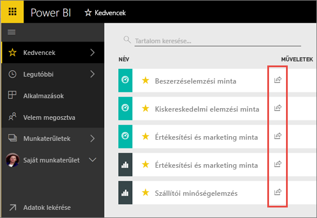
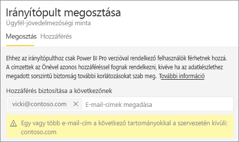
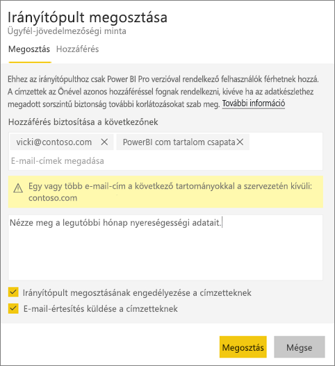
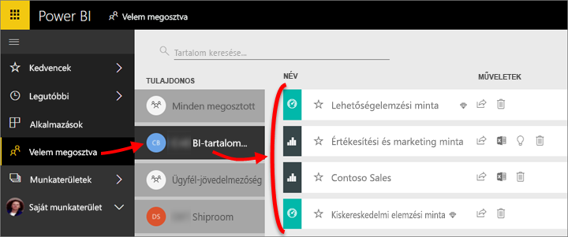
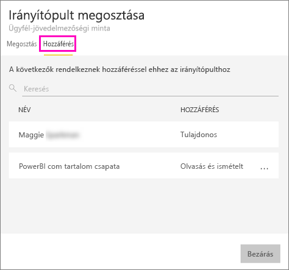
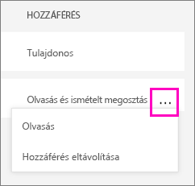

# Power BI-irányítópult és -jelentés megosztása munkatársakkal és másokkal
A *Megosztással* egyszerűen biztosíthatja néhány személy hozzáférését az irányítópultjaihoz és jelentéseihez. A Power BI-ban [többféle módon valósítható meg az irányítópultok és jelentések közös használata és terjesztése](service-how-to-collaborate-distribute-dashboards-reports.md).

Akár a cégen belül, akár a cégen kívül oszt meg tartalmat, a megosztáshoz [Power BI Pro](service-features-license-type.md)-licencre van szükség. Ha a tartalom nem [Prémium kapacitást](service-premium.md) használ, akkor a megosztás címzettjeinek is Power BI Pro-licenccel kell rendelkezniük. 

Az irányítópultok és jelentések megosztása a Power BI szolgáltatás legtöbb helyén elvégezhető, többek között a Kedvencek, a Legutóbbi, A Velem megosztva (ha a tulajdonos engedélyezte a megosztást) vagy a Saját munkaterület helyekről. A megosztott irányítópultot vagy jelentést a címzettjei megtekinthetik és használhatják, de nem szerkeszthetik. Az irányítópultok és a jelentések adatait ugyanúgy látják, ahogyan Ön is, hacsak nem alkalmaz [sorszintű biztonságot (RLS-t)](service-admin-rls.md). A munkatársai, akikkel megosztotta a tartalmat, továbboszthatják azt másokkal, ha engedélyezi. A cégén kívüli címzettek is megtekinthetik és használhatják, de nem szerkeszthetik az irányítópultot vagy jelentést. 

[Irányítópultot megoszthat bármely Power BI mobilalkalmazásból is](consumer/mobile/mobile-share-dashboard-from-the-mobile-apps.md). Irányítópultot megoszthat a Power BI szolgáltatásból és a Power BI-mobilalkalmazásokból, de a Power BI Desktopból nem.

## Videó: Irányítópult megosztása
Nézze meg, hogyan osztja meg Amanda az irányítópultját cégen belüli és azon kívüli munkatársaival. Ezután a videó alatt látható részletes utasításokat követve próbálkozzon meg a feladat elvégzésével.

<iframe width="560" height="315" src="https://www.youtube.com/embed/0tUwn8DHo3s?list=PL1N57mwBHtN0JFoKSR0n-tBkUJHeMP2cP" frameborder="0" allowfullscreen></iframe>

## Irányítópult vagy jelentés megosztása

1. Irányítópultok vagy jelentések listájában, vagy megnyitott irányítópulton vagy jelentésben válassza a **Megosztás**  lehetőséget.

1. A felső mezőbe írja be a személyek, terjesztési csoportok vagy biztonsági csoportok teljes e-mail-címét. Dinamikus terjesztési listákkal nem oszthat meg irányítópultot. 
   
   A megosztás címzettjei lehetnek a cégen kívüli címmel rendelkező személyek is, de ilyenkor figyelmeztetés jelenik meg.
   
    
 
3. Ha kívánja, hozzáfűzhet egy üzenetet. Ez nem kötelező.
4. Jelölje be az **Irányítópult/jelentés megosztásának engedélyezése a címzetteknek** lehetőséget, hogy a munkatársai megoszthassák másokkal a tartalmakat.
   
   A mások általi megosztás neve *újraosztás*. Akiknek engedélyezi, azok újraoszthatják az irányítópultot a Power BI szolgáltatásból vagy mobilalkalmazásokból, vagy továbbíthatják a meghívó e-mailt a cégen belüli más személyeknek. A meghívó egy hónap után lejár. A cégen kívüli személyek nem tudnak újraosztani. A tartalom tulajdonosaként kikapcsolhatja az újraosztás engedélyezését, és egyedi esetekre lebontva is engedélyezheti az újraosztást. Lásd a [Megosztás letiltása vagy mások általi megosztás engedélyezésének megszüntetése](service-share-dashboards.md#stop-sharing-or-stop-others-from-sharing) című részt alább.

5. Válassza a **Megosztás** lehetőséget.
   
     
   
   A Power BI a megosztott tartalomra mutató hivatkozást tartalmazó e-mailt küld az egyéni felhasználóknak, de a csoportoknak nem. Ilyenkor üzenet jelenik meg a **sikeres** végrehajtásról. 
   
   Amikor egy cégen belüli címzett a hivatkozásra kattint, a Power BI hozzáadja az irányítópultot vagy a jelentést a az ő **Velem megosztva** listázó oldalához. A címzett az Ön nevét kijelölve megtekintheti az összes Ön által vele megosztott tartalmat. 
   
   
   
   Amikor egy cégen kívüli címzett a hivatkozásra kattint, akkor látni fogja az irányítópultot vagy a jelentést, de nem a szokásos Power BI-portálon. További részletek: [Megosztás cégen kívüli személyekkel](service-share-dashboards.md#share-a-dashboard-with-people-outside-your-organization).

## Ki férhet hozzá a megosztott irányítópulthoz vagy jelentéshez?
Előfordul, hogy tudnia kell, kikkel osztott meg tartalmat, és hogy ők kivel osztották újra.

1. Az irányítópultok vagy jelentések listájában vagy magán az irányítópulton vagy jelentésen válassza a **Megosztás** lehetőséget . 
2. Az **Irányítópult/jelentés megosztása** párbeszédablakban válassza a **Hozzáférés** lehetőséget.
   
    
   
    A cégen kívüli személyek **Vendég** hozzáféréssel jelennek meg.

## Megosztás letiltása vagy mások általi megosztás engedélyezésének megszüntetése
Az újraosztást csak az irányítópult vagy jelentés tulajdonosa kapcsolhatja be és ki.

### Ha még nem küldte el a megosztási meghívót
* Szüntesse meg az **Irányítópult/jelentés megosztásának engedélyezése a címzetteknek** jelölőnégyzet kijelölését a meghívó alján, mielőtt elküldené.

### Ha már megosztotta az irányítópultot vagy jelentést
1. Az irányítópultok vagy jelentések listájában vagy magán az irányítópulton vagy jelentésen válassza a **Megosztás** lehetőséget . 
2. Az **Irányítópult/jelentés megosztása** párbeszédablakban válassza a **Hozzáférés** lehetőséget.
   
    
3. Válassza az **Olvasás és újraosztás** lehetőség melletti három pontot (**...**), majd a következőt:
   
   
   
   * **Olvasás**, hogy a címzett ne oszthassa meg az irányítópultot másokkal.
   * **Hozzáférés letiltása**, hogy az adott személy ne is tekinthesse meg a megosztott tartalmat.

4. A **Hozzáférés letiltása** párbeszédablakban arra is lehetősége van, hogy a kapcsolódó tartalmakhoz (például jelentésekhez vagy adatkészletekhez) való hozzáférést is letiltsa. Ha ilyen figyelmeztető ikonnal  rendelkező elemet távolít el, a problémamentes megjelenítés érdekében ajánlatos a kapcsolódó tartalmat is eltávolítani.

    

## Irányítópult vagy jelentés megosztása cégen kívüli személyekkel
A megosztás cégen kívüli címzettjei e-mailt kapnak a megosztott irányítópultra vagy jelentésre mutató hivatkozással, és a megtekintéséhez be kell jelentkezniük a Power BI-ba. Ha nem rendelkeznek Power BI Pro-licenccel, akkor igényelhetnek egyet, miután a hivatkozásra kattintottak.

Bejelentkezés után a bal oldali navigációs panel nélkül, a saját böngészőjükben tekinthetik meg a megosztott irányítópultot vagy jelentést, nem pedig a szokásos Power BI-portálon. Az irányítópult vagy jelentés jövőbeni eléréséhez menteniük kell a hivatkozást a kedvencek közé.

Ennek az irányítópultnak vagy jelentésnek a tartalmát egyáltalán nem módosíthatják. Használhatják a jelentés diagramjait és megváltoztathatják a szűrőket vagy a szeletelőket, de a változásokat nem menthetik.

A megosztott irányítópultot vagy jelentést csak a közvetlen címzettek láthatják. Ha az e-mailt például a Vicki@contoso.com címre küldte, akkor az irányítópultot csak Vicki tekintheti meg. Az irányítópultot más még a hivatkozás birtokában sem fogja látni, és Vickinek is ugyanezt az e-mail-címet kell használnia az irányítópult eléréséhez. Ha más e-mail-címmel jelentkezik be, akkor ő sem fog hozzáférni az irányítópulthoz.

A cégen kívüli személyek egyáltalán nem fogják látni az adatokat, ha szerepkör- vagy sorszintű biztonság van alkalmazva a helyszíni Analysis Services rendszerbeli táblázatos modellekben.

Ha Power BI-mobilalkalmazásból küld hivatkozást cégen kívüli címzettnek, akkor a hivatkozásra kattintva az irányítópult böngészőben fog megnyílni, nem a Power BI-mobilalkalmazásban.

## Korlátozások és szempontok
Irányítópultok vagy jelentések megosztásakor vegye figyelembe a következőket:

* Ön és a munkatársai általában ugyanazokat az adatokat látják az irányítópulton vagy jelentésen. Ha tehát Ön több adathoz jogosult hozzáférni mint ők, akkor az irányítópultján vagy jelentésén ők is látni fogják az összes adatát. Ha azonban [sorszintű biztonság (RLS)](service-admin-rls.md) van érvényben egy irányítópult agy jelentés alapjául szolgáló adatkészletben, akkor a hozzáférhető adatok köre az egyes személyek hitelesítő adatai alapján lesz meghatározva.
* Mindenki, akivel Ön megosztotta az irányítópultot, megtekintheti és használhatja a vonatkozó jelentéseket az [Olvasó nézetben](consumer/end-user-reading-view.md). Nem hozhatnak létre jelentéseket és nem menthetik a meglévő jelentések módosításait.
* Az adatkészletet senki sem tekintheti meg vagy töltheti le.
* Manuálisan mindenki [frissítheti az adatokat](refresh-data.md).
* Ha a levelezéshez az Office 365-öt használja, akkor a megosztás címzettjeként egy terjesztési csoportot is megadhat a csoporthoz tartozó e-mail-cím beírásával.
* Az Önnel egy e-mail-tartományban lévő munkatársai, valamint a más, de ugyanazon a bérlőn belül regisztrált tartományok tagjai másokkal is megoszthatják az irányítópultot. Legyen például a contoso.com és a contoso2.com tartomány egy bérlőn belül regisztrálva. Ha az Ön e-mail-címe konrads@contoso.com, akkor ravali@contoso.com és gustav@contoso2.com egyaránt újraoszthat, ha Ön engedélyezte számukra a megosztást.
* Ha munkatársai már hozzáférnek egy adott irányítópulthoz vagy jelentéshez, akkor nekik az irányítópultról vagy jelentésből kimásolt közvetlen hivatkozást is küldhet. Példa: `https://powerbi.com/dashboards/g12466b5-a452-4e55-8634-xxxxxxxxxxxx`
* Hasonló módon [a mögöttes jelentésre mutató közvetlen hivatkozást is küldhet](service-share-reports.md) az adott irányítópulthoz hozzáféréssel rendelkező munkatársaknak. 

## A megosztás hibaelhárítása

### Az irányítópult címzettjeinek lakat ikon vagy „Engedély szükséges” szöveg jelenik meg a címben

Előfordulhat, hogy a megosztás címzettjeinek lakat ikon vagy „Engedély szükséges” szöveg jelenik meg a címben, amikor meg akarják nézni a jelentést.

Ha ez történik, engedélyt kell adnia nekik az alapul szolgáló adatkészlethez való hozzáféréshez. Ezt a következőképp végezheti el.

1. A tartalomlistában nyissa meg az **Adatkészlet** lapot.

1. Az adatkészlet > **Engedélyek kezelése** terület mellett válassza három pontot (**...**).

    

3. Válassza a **Felhasználó hozzáadása** elemet.

    

1. Írja be a személyek, terjesztési csoportok vagy biztonsági csoportok teljes e-mail-címét. Dinamikus terjesztési listákkal nem oszthat meg irányítópultot.

    

5. Válassza a **Hozzáadás** elemet.

### Nem tudok irányítópultot vagy jelentést megosztani

Az irányítópult vagy jelentés megosztásához rendelkeznie kell a mögöttes tartalmak (minden kapcsolódó jelentés és adatkészlet) újraosztásához szükséges jogosultságokkal. Ha olyan üzenetet kap, amely szerint nincs jogosultsága a megosztáshoz, forduljon a jelentés tulajdonosához, aki engedélyt adhat Önnek az adott jelentések és adatkészletek újraosztásához.

## Következő lépések
* Visszajelzés küldene? Mondja el javaslatait a [Power BI-közösség webhelyén](https://community.powerbi.com/).
* [Irányítópultok és jelentések közös használata és megosztása](service-how-to-collaborate-distribute-dashboards-reports.md)
* [Szűrt Power BI-jelentés megosztása](service-share-reports.md)
* Kérdése van? [Kérdezze meg a Power BI közösségét](http://community.powerbi.com/).

