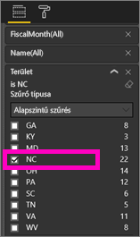
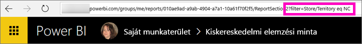
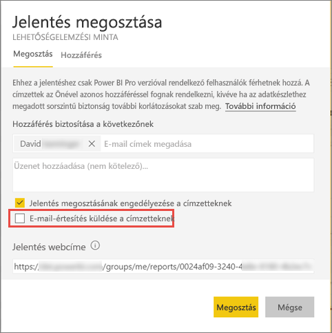

# Szűrt Power BI-jelentés megosztása munkatársakkal
A *Megosztással* egyszerűen biztosíthatja néhány személy hozzáférését az irányítópultjaihoz és jelentéseihez. A Power BI-ban [többféle módon valósítható meg a jelentések közös használata és terjesztése](service-how-to-collaborate-distribute-dashboards-reports.md).

A megosztáshoz Önnek és az összes címzetteknek is [Power BI Pro-licencre](service-features-license-type.md) van szüksége, vagy pedig a tartalomnak kell egy [Prémium-kapacitásban](service-premium.md) lennie. Javaslatai vannak? A Power BI csapata mindig szívesen fogadja visszajelzését, amelyet a [Power BI-közösség webhelyén](https://community.powerbi.com/) küldhet el.

Jelentéseket megoszthat munkatársaival, amennyiben ugyanazt az e-mail-tartományt használják, mint Ön. A megosztás a Power BI szolgáltatás legtöbb helyén elvégezhető, többek között a Kedvencek, a Legutóbbi, A Velem megosztva (ha a tulajdonos engedélyezte a megosztást) vagy a Saját munkaterület helyekről. A megosztott jelentés címzettjei használhatják, de nem szerkeszthetik a jelentést. Az adatokat ugyanúgy látják, ahogyan Ön is látja a jelentésben, hacsak nem alkalmaz [sorszintű biztonságot (RLS-t)](service-admin-rls.md). 

## Jelentés szűrése és megosztása
Mi történik olyankor, ha egy jelentésnek egy szűrt verzióját szeretné megosztani? Például egy olyan jelentést, amely csak egy adott város, év vagy értékesítő adatait jeleníti meg. Ezt egy egyedi URL-cím létrehozásával teheti meg.

1. Nyissa meg a jelentést [Szerkesztő nézetben](consumer/end-user-reading-view.md), alkalmazza a szűrőt, majd mentse a jelentést.
   
   Ebben a példában a [Kiskereskedelmi elemzési mintát](sample-tutorial-connect-to-the-samples.md) szűrjük, hogy csak azokat az értékeket mutassa, ahol a **Territory** (Terület) **NC** (Észak-Karolnia) értékű.
   
   
2. Adja hozzá a jelentésoldal URL-címéhez a következőt:
   
   ?filter=*táblanév*/*mezőnév* eq *érték*
   
    A mező **sztring** típusú kell hogy legyen, és sem a *táblanév*, sem pedig a *mezőnév* nem tartalmazhat szóközöket.
   
   A példánkban **Store** (Üzlet) a tábla neve, **Territory** (Terület) a mező neve, és **NC** (Észak-Karolnia) az érték, amelyre szűrni szeretnénk:
   
    ?filter=Store/Territory eq 'NC'
   
   
   
   A böngésző ehhez még hozzáad néhány speciális karaktert a perjelek, szóközök és aposztrófok helyettesítésére, így az eredmény a következő lesz:
   
   app.powerbi.com/groups/me/reports/010ae9ad-a9ab-4904-a7a1-xxxxxxxxxxxx/ReportSection2?filter=Store%252FTerritory%20eq%20%27NC%27

3. [Ossza meg a jelentést](service-share-dashboards.md), de törölje az **Értesítés küldése a címzetteknek e-mailben** jelölőnégyzetet. 

    

4. Küldje el a hivatkozást a korábban létrehozott szűrővel.

## Következő lépések
* Visszajelzés küldene? Mondja el javaslatait a [Power BI-közösség webhelyén](https://community.powerbi.com/).
* [Irányítópultok és jelentések közös használata és megosztása](service-how-to-collaborate-distribute-dashboards-reports.md)
* [Irányítópult megosztása](service-share-dashboards.md)
* További kérdései vannak? [Kérdezze meg a Power BI közösségét](http://community.powerbi.com/).

