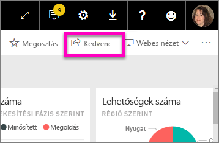
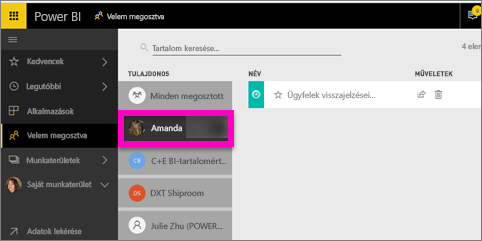

# Velem megosztott Power BI-irányítópultok megjelenítése
## Velem megosztva

Amikor a munkatársai megosztanak Önnel egy irányítópultot, akkor annak címe megjelenik a **Velem megosztva** listában. Ez az irányítópult csak a **Velem megosztva** képernyőről érhető el, és nem érhető el egy munkaterületről vagy az **Alkalmazások** képernyőről.

Nézze meg, ahogy Amanda elmagyarázza a **Velem megosztva** tartalomlistát, és bemutatja, hogyan lehet a listában navigálni és szűrőket használni. Ezután kövesse a videó alatt található részletes útmutatást, hogy Ön is kipróbálja. Az Önnel megosztott irányítópultok megtekintéséhez Power BI Pro-licencre van szükség. További részletekért olvassa el [A Power BI Premium bemutatása](service-premium.md) cikket.

<iframe width="560" height="315" src="https://www.youtube.com/embed/G26dr2PsEpk" frameborder="0" allowfullscreen></iframe>

Attól függően, hogy milyen engedélyeket kapott a tulajdonosától, több lehetősége is van egy irányítópult és az alapjául szolgáló jelentés használatára. Lehetősége lehet többek között másolatokat készíteni az irányítópultról, megnyitni a jelentés [Olvasó nézetét](service-reading-view-and-editing-view.md), és újból megosztani tartalmakat más munkatársakkal.

## A **Velem megosztva** képernyőről elérhető műveletek
* Válassza a csillag ikont, hogy [Kedvencnek jelöljön egy irányítópultot](service-dashboard-favorite.md).
* [Irányítópult eltávolítása](service-delete.md)  
* Bizonyos irányítópultok újból megoszthatók  
* Továbbá ha az irányítópultjainak listája túl hosszúra nyúlna, [használhatja a keresés mezőt és a rendezést, hogy megtalálja, amit keres](service-navigation-search-filter-sort.md).
  
  > [!NOTE]
  > Az EGRC-besorolásokról további információért válassza a besorolások gombot, majd [tekintse meg az Irányítópult adatainak besorolása cikket](service-data-classification.md).
  > 
  > 
* Az irányítópult megnyitásához és megismeréséhez válassza ki a nevét. Ha megnyitott egy megosztott irányítópultot, akkor a Q&A-val kérdéseket tehet fel az alapjául szolgáló adatokról, vagy kiválaszthatja egy jelentés címét, hogy megnyithassa és használhassa Olvasó nézetben.

## Megosztott irányítópultok szűrése tulajdonos szerint
A **Velem megosztva** képernyőn található tartalmak tovább szűrhetők a tartalom tulajdonosa szerint. Ha például kiválasztom **Amandát**, akkor csak azokat az irányítópultokat fogom látni, amelyeket Amanda osztott meg velem.

## Következő lépések
[Power BI – Alapfogalmak](service-basic-concepts.md)  
[Power BI Premium – pontosan mi is ez?](service-premium.md)  

További kérdései vannak? [Kérdezze meg a Power BI közösségét](http://community.powerbi.com/)

