# Navigáció a Power BI szolgáltatásban
## A bal oldali navigációs ablaktábla

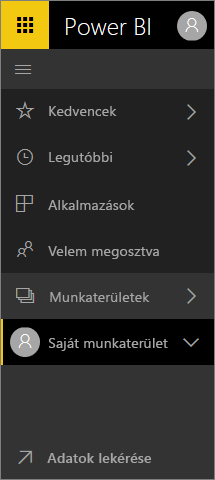

**Rövid útmutató**

| Művelet | Új (aktuális) útvonal |
| --- | --- | --- |
| Irányítópult vagy jelentés megjelölése kedvencként |Munkaterület > Irányítópultok vagy Munkaterület > Jelentések, és itt válassza ki a csillag ikont, hogy az sárga színre váltson |
| Alkalmazás megjelölése kedvencként | A bal oldali navigációs panelen válassza az **Alkalmazások** elemet, majd válassza az alkalmazás neve melletti csillagot
| A kedvencek listájának megjelenítése |Válassza ki a **Kedvencek** lehetőséget a bal oldali navigációs ablaktáblában |
| Utoljára meglátogatott irányítópultok és jelentések listájának megtekintése |Válassza ki a **Legutóbbi** lehetőséget a bal oldali navigációs ablaktáblában |
| Az Önnel megosztott irányítópultok listájának megtekintése |Válassza ki a **Velem megosztva** lehetőséget a bal oldali navigációs ablaktáblában |
| Irányítópult megosztása |Nyissa meg az irányítópultot és válassza a **Megosztás** lehetőséget, vagy hozzon létre és tegyen közzé egy alkalmazást |
| Irányítópult törlése |Saját munkaterület > Irányítópultok > szemetes ikon |
| Jelentés törlése |Saját munkaterület > Jelentések > szemetes ikon |
| Adatkészlet törlése |Saját munkaterület > Adatkészletek > ... > Törlés |
| Irányítópult megnyitása |Munkaterület > Irányítópultok > és válassza ki az irányítópult nevét |
| Jelentés megnyitása |Munkaterület > Jelentések > és válassza ki a jelentés nevét |
| Adatkészlet megnyitása |Munkaterület > Adatkészletek > és válassza ki az adatkészlet nevét |
| Irányítópult létrehozása |A felső navigációs sávban válassza a Létrehozás > Irányítópult lehetőséget |
| Jelentés létrehozása |A felső navigációs sávban válassza a Létrehozás > Jelentés lehetőséget |
| Adatkészlet létrehozása |A felső navigációs sávban válassza a Létrehozás > Adatkészlet lehetőséget |
| Alkalmazás létrehozása |Munkaterületek > Alkalmazás munkaterületének létrehozása |
| A saját tulajdonban lévő irányítópultok, jelentések, és adatkészletek listájának megtekintése |Munkaterületek > Saját munkaterület |

## Gyakori feladatok

Amanda most bemutatja a Power BI szolgáltatás navigációjának használatát.  Ezután Ön is elkezdheti az ismerkedést a videó alatt látható részletes utasítások alapján.

<iframe width="560" height="315" src="https://www.youtube.com/embed/G26dr2PsEpk" frameborder="0" allowfullscreen></iframe>

## Tartalom megtekintése (irányítópultok, jelentések, munkafüzetek, adatkészletek, munkaterületek, alkalmazások)
Kezdjük az alapvető tartalmak (irányítópultok, jelentések, adatkészletek, munkafüzetek) rendszerének megtekintésével. Korábban az összes tartalom a bal oldali navigációs ablaktáblában került felsorolásra. Erre most is lehetőség van, de mostantól alapértelmezetten csak az adott munkaterülethez kapcsolódó tartalomtípusok jelennek itt meg. Jelöljön ki egy munkaterület a bal oldali navigációs ablaktáblában, és a Power BI vásznát jobb oldalt a vonatkozó tartalmak (irányítópultok, jelentések, munkafüzetek, adatkészletek) lapfülei fogják kitölteni.

Ha a Power BI ingyenes verziójával rendelkezik, akkor csak egyetlen munkaterület jelenik itt meg – a **Saját munkaterület**.

### Irányítópultok, jelentések és alkalmazások megjelölése kedvencként
A **Kedvencek** segítségével gyorsan elérheti azokat a tartalmakat, amelyek a leginkább fontosak az Ön számára.  

1. A megnyitott irányítópultnál vagy jelentésnél válassza a **Kedvencnek jelölés** lehetőséget a jobb felső sarokban.
   
   
   
   A **Kedvencnek jelölés** átváltozik **Eltávolítás a kedvencek közül** lehetőséggé, és a csillag ikon sárgára színeződik.
   
   

2. Alkalmazás esetén válasza a navigációs panelen található **Alkalmazások** elemet, vigye a kurzort az alkalmazás fölé, majd a csillag választásával megjelölheti az alkalmazást kedvencként.

2. Az összes kedvencnek jelölt tartalom megtekintéséhez a bal oldali navigációs panelen válassza ki a **Kedvencek** felirat mellett található nyilat. Mivel a bal oldali navigációs panel mindig látható, ezért ezt a listát a Power BI szolgáltatásból bárhonnan elérheti.
   
    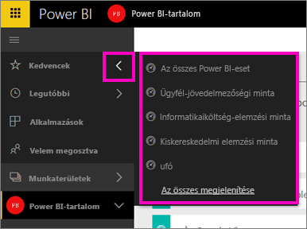
   
    Itt kiválaszthatja a megnyitni kívánt irányítópultot, jelentést vagy alkalmazást.

3. A **Kedvencek** panel megnyitásához jelölje ki a **Kedvencek** lehetőséget a bal oldali navigációs ablaktáblában, vagy válassza ki a Kedvencek ikont .
   
   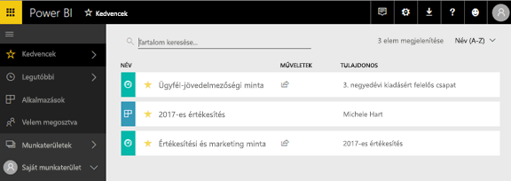
   
   Itt megnyithatja vagy megkeresheti a kívánt tartalmat, megszüntetheti a kedvencnek jelölést, vagy megoszthatja a tartalmakat munkatársaival.

1. Irányítópultot vagy jelentést a munkaterület **Irányítópultok** vagy **Jelentések** paneljén is megjelölhet kedvencként.  Ehhez nyissa meg a munkaterületet tartalom nézetben, majd válassza a név melletti csillag ikont.
   
   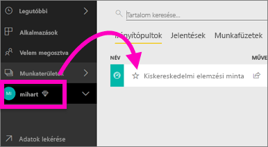

További információ: [Kedvencek](service-dashboard-favorite.md).

### Legutóbbiak
A **Legutóbbi** panel megnyitásával gyorsan hozzáférhet a legutóbb használt tartalmakhoz. Itt az összes munkaterület bármilyen tartalma megjelenhet.

  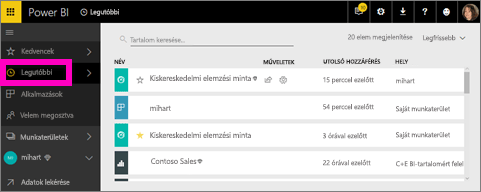

Hasonlóan a Kedvencekhez, a legutóbbi elemeket is bárhonnan elérheti a Power BI szolgáltatásból, ha a bal oldali navigációs ablaktáblán kiválasztja a **Legutóbbi** felirat mellett található nyilat.

  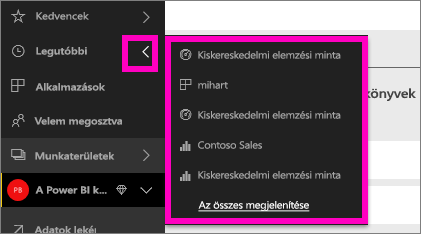

További tudnivalók: [Legutóbbi elemek a Power BI-ban](service-recent.md)

### Alkalmazások
Az alkalmazás az irányítópultok és jelentések olyan gyűjteménye, amellyel egyetlen helyen mutathatja be a közvetíteni kívánt fontosabb metrikákat. Alkalmazásokat létrehozhat kizárólag cégen belüli használatra, de olyan [külső szolgáltatások számára](service-connect-to-services.md) is, mint a Google Analytics és a Microsoft Dynamics CRM. 

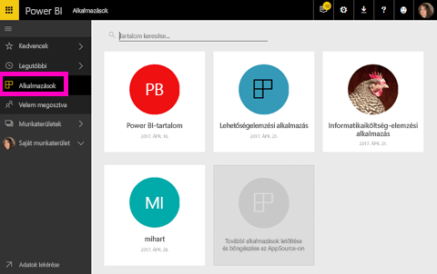

További tudnivalók: **Alkalmazás-munkaterületek** (lejjebb) és [Mik azok a Power BI-alkalmazások](service-install-use-apps.md).

### Velem megosztva
A **Velem megosztva** panelen találhatja meg az összes olyan tartalmat, amelyet a munkatársak megosztottak Önnel.  Szűrhet közöttük a tulajdonos neve alapján, a keresőmező segítségével megtalálhatja a lényeges adatokat, és dátum alapján időrendbe rendezheti az elemeket.  A gyakran látogatott megosztott tartalmakat közvetlenül a **Velem megosztva** nézetről kedvencnek is jelölheti.

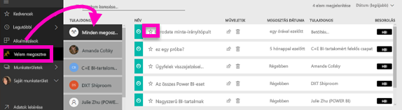

További tudnivalók: [Velem megosztva](service-shared-with-me.md)

### A munkaterületek használata
A bal oldali navigációs ablaktábla következő eleme a *munkaterületek*. A munkaterületek tulajdonképpen *tárolók* a különböző Power BI-tartalmak számára. A munkaterületeknek kétféle típusa van: **Saját munkaterület** és Alkalmazás-munkaterület.

Ha jelenleg nem tagja vagy rendszergazdája egyetlen alkalmazás-munkaterületnek sem, akkor lehet, hogy egyáltalán nem szerepel alkalmazás-munkaterület a bal oldali navigációs ablaktáblájában. Ha pedig a Power BI szolgáltatás ingyenes verzióját használja, akkor egyáltalán nem fog alkalmazás-munkaterületeket látni a listában.

#### Saját munkaterület
A **Saját munkaterület** az összes tulajdonában lévő tartalom tárolására szolgál. Tekintsen rá úgy mint a saját, személyes munkaterületére, ahol nyugodtan kísérletezhet tartalmaival. A Saját munkaterületen lévő tartalmakat megoszthatja munkatársaival is. A Saját munkaterületen belül a tartalmak 4 lapra vannak rendszerezve: Irányítópultok, Jelentések, Munkafüzetek, és Adatkészletek.

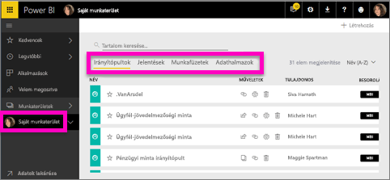

#### Alkalmazás-munkaterületek
Az alkalmazások és az alkalmazás-munkaterületek a Power BI Pro szolgáltatásban érhetőek el. Amikor Ön mások számára készít irányítópultokat és jelentéseket, akkor ezeket alkalmazás-munkaterületek használatával fogja tenni. Az alkalmazásokat az alkalmazás-munkaterület hozhatja létre, ezért az alkalmazások létrehozásának első lépése az alkalmazás-munkaterület létrehozása. Ezek a csoportos munkaterületekből fejlődtek ki – az alkalmazás tartalmához használt átmeneti területekből és tárolókból állnak.  Itt munkatársaival együttesen hozhatnak létre irányítópultokat, jelentéseket és egyéb olyan tartalmakat, amelyeket később egy szélesebb közönség, vagy akár az egész cég elé fognak majd terjeszteni.

További tudnivalókkal az [Alkalmazások létrehozása és terjesztése a Power BI-ban](service-create-distribute-apps.md#app-workspaces) című cikk szolgál.

Ugyanúgy mint a **Saját munkaterület** esetében, a tartalom itt is 4 lapra van rendszerezve: Irányítópultok, Jelentések, Munkafüzetek és Adatkészletek.

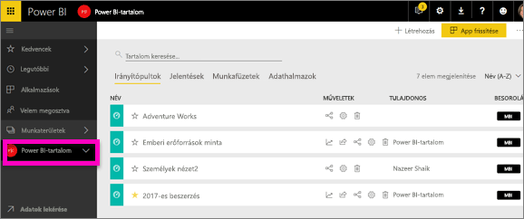

Munkaterület váltásához válassza ki a **Munkaterületek** lehetőséget a bal oldali navigációs ablaktáblán.

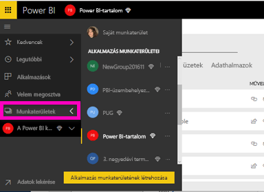

### Tartalom keresése és rendezése
A tartalom nézet megkönnyíti a különböző tartalmak keresését, szűrését és rendezését. Egy adott irányítópult, jelentés vagy munkafüzet megkereséséhez használja a keresőmezőt. A Power BI csak azokat a szűrt találatokat jeleníti meg, amelyek neve tartalmazza az adott keresőszót.

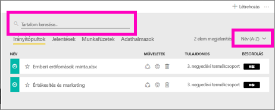

A tartalmakat a nevük vagy a tulajdonosuk alapján is rendezheti.  

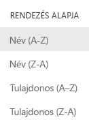

További információkat itt talál: [Navigáció a Power BI-ban: keresés, rendezés, szűrés](service-navigation-search-filter-sort.md)

## Következő lépések
A Power BI szolgáltatás [alapfogalmai](service-basic-concepts.md)    

Kérdése van, vagy visszajelzést küldene? [Látogasson el a Power BI-közösség fórumára](http://community.powerbi.com/t5/Navigation-Preview-Forum/bd-p/NavigationPreview)

