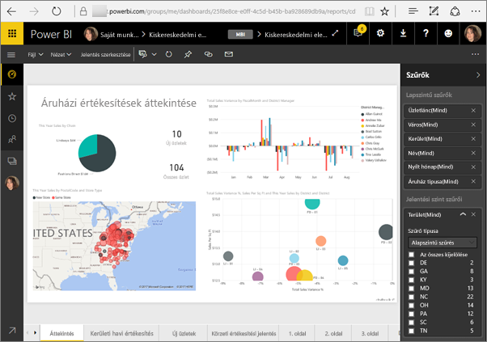
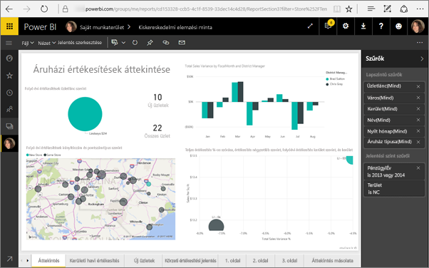

# <a name="filter-a-report-using-query-string-parameters-in-the-url"></a>Jelentés szűrése lekérdezésisztring-paraméterek URL-címben való használatával
A Power BI szolgáltatásban megnyitott jelentések minden egyes oldalának saját egyedi URL-címe van. Az adott jelentésoldal a jelentésvászon Szűrők paneljének használatával szűrhető.  A jelentés úgy is szűrhető, hogy lekérdezésisztring-paramétereket ad hozzá a jelentés URL-címéhez. Tegyük fel, hogy egy jelentést meg szeretne mutatni a munkatársainak, és előre szűrni szeretné azt a számukra. Ennek egyik módja, hogy a jelentés alapértelmezett URL-címéből kiindulva hozzáfűzi ahhoz a szűrési paramétereket, majd elküldi nekik a teljes URL-címet.



<iframe width="640" height="360" src="https://www.youtube.com/embed/WQFtN8nvM4A?list=PLv2BtOtLblH3YE_Ycas5B1GtcoFfJXavO&amp;showinfo=0" frameborder="0" allowfullscreen></iframe>

## <a name="query-string-parameter-syntax-for-filtering"></a>Lekérdezésisztring-paraméterek szintaxisa szűréshez
A szintaxis nagyon egyszerű – kezdje a jelentés URL-címével, adjon hozzá egy kérdőjelet, majd a szűrési szintaxist.

URL-cím?filter=***Tábla***/***Mező*** eq '***érték***'


* A **Tábla** és a **Mező** név megkülönbözteti a kis- és nagybetűket, az **érték** viszont nem.
* A jelentésnézetben rejtett mezők is szűrhetők.
* Az **értéket** aposztrófok között kell megadni.
* A mezőnek sztring típusúnak kell lennie.
* A tábla és a mező neve nem tartalmazhat szóközöket.

Ha egyelőre nem minden világos, akkor olvasson tovább, és bővebb kifejtést is találhat.  

## <a name="filter-on-a-field"></a>Szűrés egy mező alapján
Tegyük fel például, hogy a jelentés URL-címe a következő.


A térkép-vizualizáción (fent) látható, hogy üzleteink vannak Észak-Karolinában.

>[!NOTE]
>Ez a példa a [Kiskereskedelmi elemzési mintán](sample-datasets.md) alapszik.
> 

Ha úgy szeretné szűrni a jelentést, hogy csak az Észak-Karolinában („NC”) található üzletek adatait jelenítse meg, akkor fűzze hozzá az URL-címhez a következőt;

?filter=Store/Territory eq 'NC'


>[!NOTE]
>Az *NC* (North Carolina, Észak-Karolina) érték a **Store** (Üzlet) tábla **Territory** (Terület) mezőjében található meg.
> 
> 

A jelentés szűrve lett Észak-Karolinára, és a jelentés oldalán található összes vizualizáció csak Észak-Karolina adatait jeleníti meg.



## <a name="filter-on-multiple-fields"></a>Szűrés több mező alapján
Ha további paramétereket fűz az URL-címhez, több mező alapján is végezhet szűrést. Térjünk vissza az eredeti szűrési paraméterhez.

```
?filter=Store/Territory eq 'NC'
```

További mezők alapján úgy szűrhet, hogy az `and` kulcsszót és egy újabb mezőt ad meg a fentinek megfelelő formátumban. Íme egy példa.

```
?filter=Store/Territory eq 'NC' and Store/Chain eq 'Fashions Direct'
```

<iframe width="640" height="360" src="https://www.youtube.com/embed/0sDGKxOaC8w?showinfo=0" frameborder="0" allowfullscreen></iframe>


### <a name="using-dax-to-filter-on-multiple-values"></a>Szűrés több értékre a DAX használatával
A szűrés egy másik módja, ha létrehoz egy számított oszlopot, amely két mezőt egyetlen értékké fűz össze. Ezt követően már szűrhet erre az értékre.

Legyen a két mező például a Territory (Terület) és a Chain (Üzletlánc). [Hozzon létre egy új számított oszlopot](desktop-tutorial-create-calculated-columns.md) (Mezőt) a Power BI Desktopban, TerritoryChain (TerületÜzletlánc) néven. Ne feledje, hogy a **Mező** neve nem tartalmazhat szóközöket. Az oszlop DAX-képlete a következő.

TerritoryChain = [Territory] & " - " & [Chain]

Tegye közzé a jelentést a Power BI szolgáltatásban, majd az URL-cím lekérdezési sztringjével szűrje azt úgy, hogy csak az Észak-Karolinában található Lindseys üzletek adatait jelenítse meg.

https://app.powerbi.com/groups/me/reports/8d6e300b-696f-498e-b611-41ae03366851/ReportSection3?filter=Store/TerritoryChain eq 'NC–Lindseys'

## <a name="pin-a-tile-from-a-filtered-report"></a>Szűrt jelentésből származó csempe rögzítése
Miután lekérdezésisztring-paraméterek használatával szűrte a jelentést, abból származó vizualizációkat rögzíthet az irányítópulton. Az irányítópulton lévő csempe a szűrt adatokat jeleníti meg, a csempe kiválasztásakor pedig megnyílik a létrehozásához használt jelentés.  Az URL-címmel alkalmazott szűrés azonban nem lesz a jelentéssel együtt mentve, és az irányítópult csempéjének kiválasztása után a jelentés szűretlen állapotban nyílik meg.  Ez azzal jár, hogy az irányítópult csempéjén látható adatok nem egyeznek meg azokkal, amelyek a jelentésben lévő vizualizáción megjelennek.

Bizonyos esetekben ez hasznos is lehet, ha különböző eredményeket szeretne látni: szűrve az irányítópulton és szűrés nélkül a jelentésben.

## <a name="limitations-and-troubleshooting"></a>Korlátozások és hibaelhárítás
Lekérdezésisztring-paraméterek használatakor néhány szemponttal érdemes tisztában lenni.

* A lekérdezési sztringgel végzett szűrés [webes közzététellel](service-publish-to-web.md) és Power BI Embedded használatával nem működik.   
* A mezőnek sztring típusúnak kell lennie.
* A tábla és a mező neve nem tartalmazhat szóközöket.

## <a name="next-steps"></a>Következő lépések
[Vizualizáció rögzítése az irányítópulton](service-dashboard-pin-tile-from-report.md)  
[Próbálja ki – ingyenes!](https://powerbi.com/)

További kérdései vannak? [Kérdezze meg a Power BI közösségét](http://community.powerbi.com/)

