# Használati metrikák irányítópultokhoz és jelentésekhez

Ha irányítópultokat és jelentéseket készít, akkor a használati metrikák segítenek megérteni azok hatásosságát. Az irányítópultra vagy jelentésre vonatkozó használati metrikák futtatásával feltárhatja, hogyan használják a szervezetén belül az irányítópultokat és jelentéseket, ki mit használ fel, és milyen célra.  

> [!NOTE]
> A használati metrikák mérik a SharePoint Online-ban beágyazott jelentések használatát. A használati metrikák azonban nem követik nyomon az irányítópultoknak és a jelentéseknek a „felhasználó a hitelesítő adatok tulajdonosa” és az „alkalmazás a hitelesítő adatok tulajdonosa” folyamaton keresztüli beágyazását. A használati metrikák a [webes közzétételen](service-publish-to-web.md) keresztül beágyazott jelentések használatát sem követik nyomon.

Ezek a használati metrikai jelentések csak olvashatók. Egy használati metrikai jelentés mégis testre szabható a "Mentés másként" lehetőség használatával. Ezzel teljesen új adatkészlet jön létre, a csak olvasható jelentés pedig teljes értékű, szerkeszthető Power BI-jelentéssé alakul át. A testre szabott jelentés nem csupán az adott irányítópult vagy jelentés metrikáit tartalmazza, de az alapértelmezett szűrő törlésével a kiválasztott munkaterület minden irányítópultjának vagy minden jelentésének használati metrikáihoz hozzáférést biztosít. És a végfelhasználók nevét is megtekintheti.

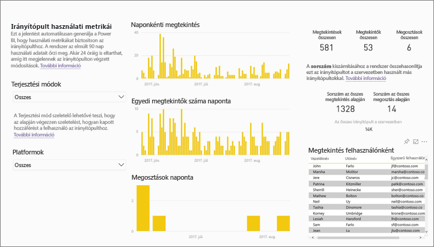

## Miért fontosak számomra a használati metrikák?

A tartalom felhasználási módjának ismerete segít az eredményesség szemléltetésében és a feladatok fontossági sorrendjének felállításában. Egy használati metrika megmutathatja, hogy az egyik jelentést naponta használja a szervezet egy jelentős része, vagy éppen azt, hogy egy létrehozott irányítópultot senki sem tekint meg. Az ilyen visszajelzés felbecsülhetetlen értékű útmutatást nyújt a munkaszervezésben.

Használati metrikai jelentések futtatására csak a Power BI szolgáltatásban van lehetőség.  A mentett, vagy irányítópulton rögzített használati metrikák azonban mobileszközökön is megnyithatók és kezelhetők.

### Előfeltételek

- A használati metrika funkció a hozzájuk rendelt licenc típusától függetlenül minden felhasználónál rögzíti a használattal kapcsolatos adatokat. A használati metrikai adatok futtatása és elérése azonban csak Power BI Pro-licenc birtokában lehetséges.
- Használati metrikák az irányítópultokhoz és a jelentésekhez állnak rendelkezésre a kiválasztott munkaterületen. Egy adott irányítópult vagy jelentés használati metrikai adataihoz a következő feltételekkel férhet hozzá:    
    • Az irányítópultra vagy a jelentésre vonatkozó szerkesztési joggal rendelkezik • Rendelkezik a Pro verzió licencével

## Tudnivalók a használati metrikai jelentésről

Ha a **Használati metrikák** lehetőséget vagy a  ikont választja, a Power BI egy előre elkészített, az utolsó 90 napra vonatkozó jelentést készít az adott tartalomról.  A jelentés hasonlít a már ismert Power BI-jelentésekhez, de csak tájékoztatásra szolgál – nem interaktív. Szűkíthető az alapján, hogy a felhasználók hogyan kaptak hozzáférést, és hogy weben, mobilalkalmazáson vagy más lehetőségen keresztül érték el. Az irányítópultok és jelentések változásait az új adatokkal naponta frissülő használati metrikai jelentések is tükrözik.  

A használati metrikai jelentések nem jelennek meg a **Legutóbbi**, a **Munkaterületek**, a **Kedvencek** vagy más tartalomlistákon. Nem lehet őket hozzáadni egy alkalmazáshoz. Ha egy használati metrikai jelentésből származó csempét hozzáad egy irányítópulthoz, akkor az az irányítópult már nem adható hozzá alkalmazáshoz vagy tartalomcsomaghoz.

Ha mélyen kívánja elemezni a jelentés adatait, vagy saját jelentéseket kíván készíteni az adatkészlet alapján, akkor használja a **Mentés másként** lehetőséget (lásd: [Használati metrikai jelentés mentése teljes értékű Power BI-jelentésként](#Save-the-Usage-Metrics-report-as-a-full-featured-Power-BI-report-(personalize))).

## Használati metrikai jelentés megnyitása irányítópulthoz vagy jelentéshez

1. Kezdje a munkát az irányítópultot vagy jelentést tartalmazó munkaterületen.
2. Akár munkaterület tartalomlistájából, akár magából az irányítópultból vagy jelentésből válassza a **Használati metrikák**  ikonját.

    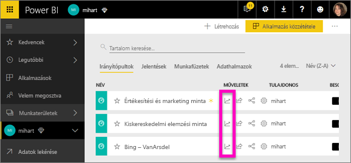

    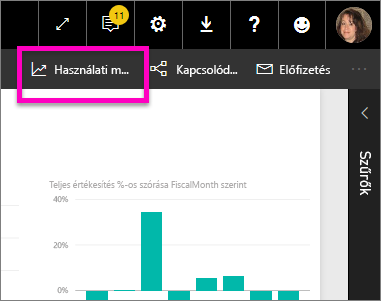
3. Amikor először teszi ezt, a Power BI létrehozza a használati metrikai jelentést, és értesíti önt, amikor elkészült.

    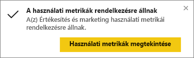
4. Az eredmény megnyitásához válassza a **Használati metrikák megtekintése** lehetőséget.

    A használati metrikák hasznos segítséget nyújtanak a Power BI-irányítópultok és -jelentések létrehozásához és fenntartásához. Szeretné tudni, hogy a jelentése mely oldalai a leghasznosabbak, és melyeket kellene kihagynia? Megtudhatja, ha szűkíti a listát **Jelentésoldalak** szerint. Fontolgatja, hogy kialakítson-e mobil elrendezést az irányítópulthoz? A **Platformok** szerinti szűkítés révén megtudhatja, hogy hány felhasználó éri el a tartalmat mobilalkalmazáson, és hány a weben keresztül.

5. A vizualizáció irányítópultra történő felvételéhez vigye a kurzort az egyik vizualizáció fölé, és válassza a kitűzés ikont. Vagy a felső menüsávon válassza az **Élő oldal rögzítése** lehetőséget, amivel a teljes oldalt rögzítheti az irányítópulton. Az irányítópulton egyszerűbben követheti a használati metrikákat, és meg is oszthatja őket.

    > [!NOTE]
    > Ha egy használati metrikai jelentésből származó csempét hozzáad egy irányítópulthoz, akkor az az irányítópult már nem adható hozzá alkalmazáshoz vagy tartalomcsomaghoz.

## Milyen metrikák szerepelnek a jelentésben?

| Metrika | Irányítópult | Jelentés | Leírás |
| --- | --- | --- | --- |
| Hozzáférési mód szerint |igen |igen |Hogyan érik el a felhasználók a tartalmat. Három mód lehetséges: a felhasználók elérhetik a jelentést vagy irányítópultot azáltal, hogy egy [alkalmazás munkaterületének](consumer/end-user-experience.md) tagjai, hogy a tartalom [meg van osztva velük](service-share-dashboards.md), vagy egy tartalomcsomag/alkalmazás telepítésével.  Megjegyzendő, hogy az alkalmazáson keresztül történő hozzáférés "tartalomcsomagként” számítódik be. |
| Platform szerint |igen |igen |A Power BI szolgáltatáson (powerbi.com) keresztül, vagy mobileszközzel érték el az irányítópultot vagy jelentést? Mobileszköznek számít minden iOS-, Android- és Windows-alkalmazásunk is. |
| Jelentésoldalak szerint |nem |igen |Ha a jelentés terjedelme egy oldalnál nagyobb, akkor az a megtekintett oldal(ak) szerint vizsgálható. Ha a listában "Üres" elem látható, az azt jelenti, hogy egy oldalt a közelmúltban adtak hozzá a jelentéshez (az új oldal tényleges neve 24 órán belül megjelenik a szűrési listában) és/vagy azt, hogy a jelentésből oldalakat töröltek. Az "Üres" elem ezeket az eseteket jelzi. |
| Naponkénti megtekintés |igen |igen |A naponkénti megtekintések teljes száma – megtekintésnek számít, ha egy felhasználó betölt egy jelentésoldalt vagy egy irányítópultot. |
| Egyedi megtekintők száma naponta |igen |igen |Az irányítópultot vagy jelentést megtekintő *különböző* felhasználók száma (az AAD-felhasználói fiók alapján). |
| Megtekintés felhasználónként |igen |igen |A megtekintések száma az utolsó 90 napban, egyedi felhasználókra lebontva. |
| Megosztások naponta |igen |nem |Ahányszor az irányítópultot megosztották másik felhasználóval vagy csoporttal. |
| Megtekintések összesen |igen |igen |Megtekintések száma az utolsó 90 napban. |
| Megtekintők összesen |igen |igen |Egyedi megtekintők száma az utolsó 90 napban. |
| Megosztások összesen |igen |nem |Ahányszor az irányítópultot megosztották az utolsó 90 napban. |
| Szervezeten belüli mennyiség |igen |igen |A teljes szervezeten belüli összes olyan irányítópult vagy jelentés száma, amelyet legalább egyszer megtekintettek az utolsó 90 napban.  Rangsorolás kiszámításához használható. |
| Rang: Megtekintések összesen |igen |igen |Hányadik ez az irányítópult vagy jelentés a szervezeten belüli irányítópultok vagy jelentések rangsorában az utolsó 90 napban történt megtekintések száma szerint. |
| Rang: Megosztások összesen |igen |nem |Hányadik ez az irányítópult a szervezeten belüli irányítópultok rangsorában az utolsó 90 napban történt megosztások száma szerint. |

### Használati metrikai jelentés irányítópulthoz

### Használati metrikai jelentés jelentéshez

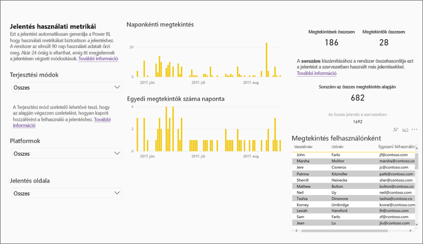

## Használati metrikai jelentés mentése teljes értékű Power BI-jelentésként (testreszabás)

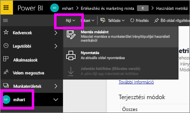

Használati metrikai jelentés teljes értékű, testre szabható és megosztható Power BI-jelentéssé alakításához használja a **Mentés másként** lehetőséget. A testre szabott másolat elkészítése után teljes hozzáférése lesz a jelentés alapjául szolgáló adatkészlethez, így az aktuális igények szerint szabadon testre szabhatja a használati metrikai jelentést. Akár a Power BI Desktop használatával is készíthet egyéni használati metrikai jelentéseket a [Power BI szolgáltatással való élő kapcsolaton](https://powerbi.microsoft.com/blog/connecting-to-datasets-in-the-power-bi-service-from-desktop) keresztül.

Az alapul szolgáló adatkészlet ráadásul magában foglalja a munkaterület összes irányítópultjának és jelentésének használati adatait. Ezzel a lehetőségek egy új köre nyílik meg. Készíthet például olyan jelentést, amely a munkaterületén belüli összes irányítópultot összehasonlítja használat alapján. Használati metrikai irányítópultot is készíthet Power BI-alkalmazásához az alkalmazásban megosztott valamennyi tartalom használati adatainak összegzésével.  Az [oldalszintű szűrő eltávolításáról](#remove-the-filter-to-see-all-the-usage-metrics-data-in-the-workspace) egy későbbi szakaszban olvashat.

### Mi jön létre a "Mentés másként" művelet során?

A Power BI a teljes értékű jelentéssel együtt egy új adatkészletet is létrehoz **az aktuális munkaterülethez tartozó valamennyi irányítópultból vagy jelentésből**, amelyhez az utolsó 90 napban hozzáfértek. Tegyük fel, hogy van egy három irányítópultot és két jelentést tartalmazó, "Értékesítés" nevű munkaterülete, és használati metrikai jelentést készít az "Északkelet” nevű irányítópultról. A **Mentés másként** lehetőséget használja, hogy testre szabja és teljes értékű jelentéssé alakítsa. Az új jelentés adatkészlete *nem csupán az "Északkelet” nevű irányítópult* használati metrikáit tartalmazza, hanem az "Értékesítés" nevű munkaterület mindhárom irányítópultjáét. A jelentés alapértelmezés szerint az "Északkelet” irányítópult adatait jeleníti meg, és [el kell távolítania a szűrőt](#remove-the-filter-to-see-all-the-usage-metrics-data-in-the-workspace) (egy kattintás), hogy mind a három irányítópult adatai megjelenjenek.

### Használati jelentés másolatának létrehozása a "Mentés másként" lehetőséggel

Amikor a "Mentés másként" (testre szabás) lehetőséggel másolatot hoz létre, a Power BI teljes értékű jelentéssé alakítja a csak olvasható, előre elkészített jelentést.  Első ránézésre pontosan ugyanolyannak tűnik. Csakhogy a jelentés most már megnyitható Szerkesztő nézetben, hozzáadhat vizualizációkat, szűrőket és oldalakat, módosíthat vagy törölhet meglévő vizualizációkat, és sok további lehetőség is megnyílik. A Power BI az új jelentést és az adatkészletet az aktuális munkaterületen menti. Az alábbi példában az aktuális munkaterület a **mihart**.

1. Az előre elkészített használati metrikai jelentésben válassza a **Fájl > Mentés másként** lehetőséget. A Power BI teljes értékű Power BI-jelentéssé alakítja a használati metrikai jelentést. Ez egy úgynevezett *testre szabott* használati metrikai jelentés. A személyre szabott használati jelentést és az adatkészletet a rendszer az aktuális munkaterületen menti, amelynek neve **mihart*.

    
2. Nyissa meg a jelentést Szerkesztő nézetben és [dolgozzon vele ugyanúgy, mint bármely más Power BI-jelentéssel](service-interact-with-a-report-in-editing-view.md). Hozzáadhat például új oldalakat, készíthet új vizualizációkat, felvehet szűrőket, formázhatja a betűtípusokat és színeket, stb.

    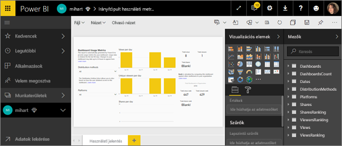
3. Azt is megteheti, hogy az új adatkészletet használva teljesen új jelentést készít.

    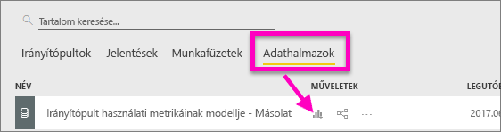
4. Az új jelentés az aktuális munkaterületre (mihart) lesz mentve, és hozzá lesz adva a **Legutóbbi** tartalomlistához is.

    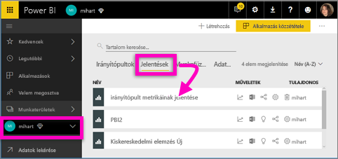

### Szűrő eltávolítása a munkaterület ***összes*** használati metrikai adatának megjelenítéséhez

Ahhoz, hogy a munkaterület valamennyi irányítópultjának vagy valamennyi jelentésének metrikái megjelenjenek, törölnie kell egy szűrőt. A testre szabott jelentés alapértelmezés szerint úgy van szűrve, hogy csak a létrehozásához használt irányítópult vagy jelentés metrikáit jelenítse meg.

Ha az új, testre szabott jelentés létrehozásához például az "Európai eladások" nevű irányítópultot használta, akkor csak az "Európai eladások" irányítópult használati adatai fognak megjelenni. Hogy a munkaterület valamennyi irányítópultjának adatai megjelenjenek, a következő lépésekkel távolíthatja el a szűrőt:

1. Nyissa meg a testre szabott jelentést Szerkesztő nézetben.

    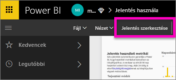
2. A keresse meg a **Jelentésszintű szűrők** gyűjtőt a Szűrők panelen, és távolítsa el a szűrést az "x" választásával.

    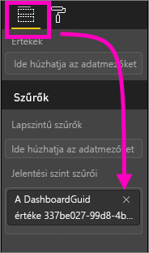

    A testre szabott jelentés ettől kezdve a teljes munkaterület metrikáit mutatja.

## Rendszergazdai vezérlőelemek használati metrikákhoz – Power BI-rendszergazdák számára

A használati metrikai jelentés olyan funkció, amelyet a Power BI vagy Office 365 rendszergazdája kapcsolhat be vagy ki. A rendszergazdák részletesen szabályozhatják, hogy mely felhasználók férnek hozzá a használati metrikákhoz. Ez alapértelmezés szerint a szervezet összes felhasználójánál engedélyezve van.

1. Nyissa meg a Felügyeleti portált a Power BI szolgáltatás jobb felső sarkában lévő fogaskerék ikont, majd a **Felügyeleti portál** lehetőséget választva.

    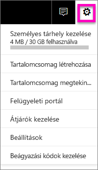
2. A Felügyeleti portálon válassza a **Bérlői beállítások**, majd a **Tartalomkészítőknek szánt használati metrikák** lehetőséget.

    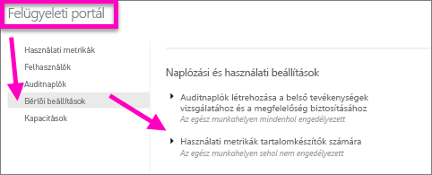
3. Engedélyezze (vagy tiltsa le) a használati metrikákat, majd válassza az **Alkalmaz** lehetőséget.

    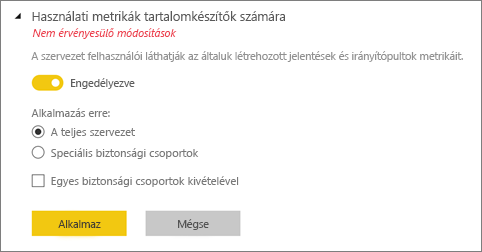

Alapértelmezés szerint a felhasználónkénti adatok engedélyezve vannak a használati metrikákhoz, a tartalomkészítői fiókadatok pedig szerepelnek a metrikák jelentéseiben. Ha ezt az információt nem szeretné belefoglalni egyes felhasználók esetében, tiltsa le a funkciót megadott biztonsági csoportok, vagy a teljes szervezet számára. A fiókadatok ekkor *névtelenként* jelennek meg a jelentésben.

Amikor a teljes szervezet számára letiltja a használati metrikákat, a rendszergazda a **teljes meglévő használati metrikai tartalom törlése** lehetőséggel törölni tud minden meglévő jelentést és irányítópult-csempét, amely a használati metrikai jelentések és adatkészletek használatával készült. Ezen a módon minden használati metrikai adat hozzáférhetetlenné válik a szervezet valamennyi felhasználója számára, akik esetleg már használják is azokat. Fontolja meg ezt a lépést, mert a meglévő használati metrikai tartalom törlése nem vonható vissza.

## Használati metrikák az országos felhőkben

A Power BI elérhető különálló országos felhőkben. Ezek a felhők ugyanolyan szintű biztonságot, adatvédelmet, megfelelőséget és átláthatóságot kínálnak, mint a Power BI globális verziója, de a szolgáltatásnyújtás, az adatok tárolási helye, a hozzáférés és a vezérlés terén a helyi jogszabályoknak megfelelő egyedi modellel kombinálva. Ennek a helyi jogszabályok szerint kialakított egyedi modellnek köszönhetően a használati metrikák az országos felhőkben nem állnak rendelkezésre. További információért lásd az [szuverén felhők](https://powerbi.microsoft.com/en-us/clouds/) weblapját.

## Megfontolandó szempontok és korlátozások

K:    Nem tudok használati metrikát futtatni egy irányítópulton vagy jelentésen. V:    A használati metrikák csak olyan tartalmakon tekinthetők meg, amelyeknek Ön a tulajdonosa, vagy amelyekhez szerkesztési engedélye van.

K:    Rögzíti a használati metrika a beágyazott irányítópultokon és jelentéseken keresztül történő megtekintéseket?
V:    A használati metrikák jelenleg nem támogatják a használati adatok gyűjtését beágyazott irányítópultok, jelentések, valamint a [webes közzétételi](service-publish-to-web.md) folyamat esetében.          Ezekben az esetekben a meglévő webes elemző platformok használatát ajánljuk az üzemeltető alkalmazás vagy portál használatának nyomon követéséhez.

K:    Semmilyen tartalmon sem tudok használati metrikát futtatni.
V1:    Ezt a funkciót a rendszergazdák kikapcsolhatják a szervezeten belül.  Kérdezze meg a rendszergazdától, hogy ez-e a helyzet.
V2:    A használati metrika a Power BI Pro funkciója.

K:    Úgy látom, hogy az adatok nem naprakészek. Nem jelennek meg például a terjesztési módok, oldalak hiányoznak egy jelentésből, stb. V:    Az adatok frissülése akár 24 órát is igénybe vehet.

K:    A munkaterületen négy jelentés van, de a használati metrikai jelentésben csak három látszik.
V:    A használati metrikai jelentésben csak azok a jelentések (vagy irányítópultok) jelennek meg, amelyekhez az utolsó 90 napban hozzáfértek.  Ha egy jelentés (vagy irányítópult) nem jelenik meg, akkor valószínűleg több mint 90 napja használták utoljára.

## Következő lépések

[Irányítópult megjelölése kedvencként](consumer/end-user-favorite.md)

További kérdései vannak? [Kérdezze meg a Power BI közösségét](http://community.powerbi.com/)