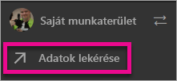
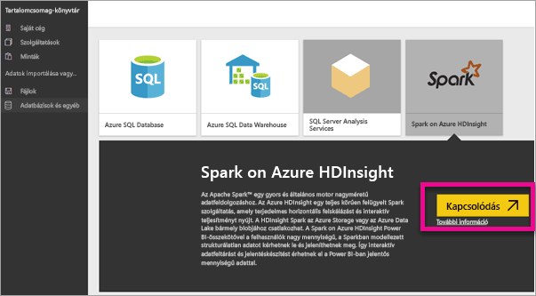
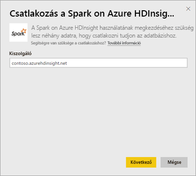
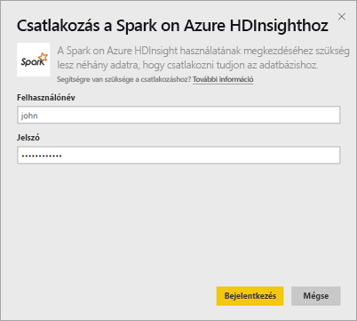
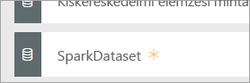
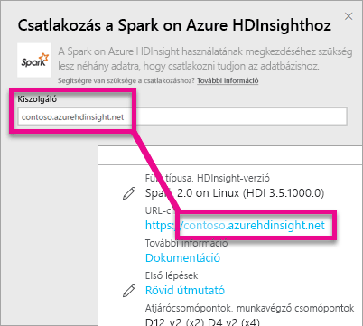
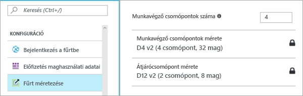

# A Spark on HDInsight és a DirectQuery

A Spark on Azure HDInsight és a DirectQuery együttes használatával dinamikus jelentéseket hozhat létre a Spark-fürtben már meglévő adatok és metrikák alapján. A DirectQuery a jelentésnézet adatainak vizsgálatakor az Azure HDInsight Spark-fürtre küldi vissza a lekérdezéseket. Ez azoknak a felhasználóknak ajánlott, akik jól ismerik az entitásokat, amelyekhez csatlakoznak.

> [!WARNING]
> Az automatikus csempefrissítés a Spark-alapú adatkészletek irányítópult-csempéin le van tiltva. **Az irányítópult csempéinek frissítése** elem kiválasztásával manuálisan frissítheti a csempéket. A jelentéseket ez nem érinti, és mindig naprakészek. 

Az alábbi lépések végrehajtásával kapcsolódhat a Spark on Azure HDInsight-adatforráshoz a Power BI szolgáltatás DirectQuery funkciójával.

> [!Important]
> Továbbfejlesztettük a Spark-kapcsolódást.  A Sparkbeli adatforráshoz való kapcsolódás leghatékonyabb módja a Power BI Desktop használata.  Miután elkészítette a modellt és a jelentést, közzéteheti a Power BI szolgáltatásban.  A Spark a Power BI szolgáltatásban használt közvetlen összekötője elavult.

1. A bal oldali navigációs ablaktábla alján kattintson az **Adatok lekérése** elemre.

     
2. Válassza az **Adatbázisok és egyéb** lehetőséget.

     
3. Válassza a **Spark on HDInsight**-összekötőt, majd a **Kapcsolódás** lehetőséget.

     
4. Adja meg a **kiszolgáló** nevét, amelyhez kapcsolódni kíván, továbbá a **felhasználónevét** és **jelszavát**. A kiszolgáló neve mindig a \<fürtnév\>.azurehdinsight.net formátumban van. Az értékeknek megkeresésével kapcsolatos további részleteket lásd alább.

     

     
5. A csatlakozás után egy új adatkészlet jelenik meg „SparkDataset” néven. Az adatkészlet létrejövő helyőrző csempén keresztül is elérhető.

     
6. A adatkészlet részletes vizsgálatával az adatbázisban lévő összes táblát és oszlopot feltárhatja. Ha kiválaszt egy oszlopot, a rendszer lekérdezi a forrást, és dinamikusan hozza létre a vizualizációt. Ezek a vizualizációk menthetők egy új jelentésbe, és újra rögzíthetők az irányítópultra.

## A Spark on HDInsight-paraméterek megkeresése

A kiszolgáló neve mindig a \<fürtnév\>.azurehdinsight.net formátumban van, és az Azure Portalon található.

A felhasználónév és a jelszó szintén megtalálható az Azure Portalon.

## Korlátozások

Ezek a korlátozások és figyelmeztetések a felhasználói felületek fejlesztésével változhatnak. További dokumentációért lásd: [BI-eszközök használata az Apache Spark on Azure HDInsighttal](https://azure.microsoft.com/documentation/articles/hdinsight-apache-spark-use-bi-tools/)

* A Power BI szolgáltatás kizárólag a Spark 2.0-ból és a HDInsight 3.5-ből álló konfigurációt támogatja.
* Minden művelet, például az oszlopok kijelölése vagy a szűrők hozzáadása azzal jár, hogy a rendszer lekérdezi az adatbázist – mielőtt nagyon nagy mezőket jelölne ki, érdemes kiválasztania egy megfelelő vizualizációtípust.
* A Q&A nem érhető el a DirectQuery-adatkészletek esetén.
* A rendszer nem követi automatikusan a sémák változásait.
* A Power BI összesen legfeljebb 16 000 oszlopot támogat egyszerre egy adott adatkészlet **összes tábláján**. A Power BI táblánként egy belső oszlopot is tartalmaz a sorszámoknak. Ez azt jelenti, hogy ha az adatkészlet 100 táblát tartalmaz, az oszlopok száma legfeljebb 15 900 lehet. A Spark adatforrásból származó adatok mennyiségétől függően elképzelhető, hogy eléri ezt a korlátot.

## Hibaelhárítás

Ha a fürtre küldött lekérdezések során hiba történik, ellenőrizze, hogy az alkalmazás nem állt-e le, és szükség esetén indítsa újra.

Az Azure Portalon további erőforrásokat is hozzárendelhet a **Konfiguráció** > **Fürt méretezése** felületen:

## Következő lépések

[Első lépések: Apache Spark-fürt létrehozása HDInsight Linux rendszeren és interaktív lekérdezések futtatása Spark SQL használatával](https://azure.microsoft.com/documentation/articles/hdinsight-apache-spark-jupyter-spark-sql)  
[Mi az a Power BI?](power-bi-overview.md)  
[Power BI – Adatok lekérése](service-get-data.md)
[Kerberos használata a helyszíni átjárón egyszeri bejelentkezéshez (SSO)](service-gateway-kerberos-for-sso-pbi-to-on-premises-data.md)

További kérdései vannak? [Kérdezze meg a Power BI közösségét](http://community.powerbi.com/)