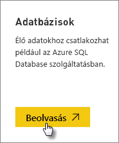
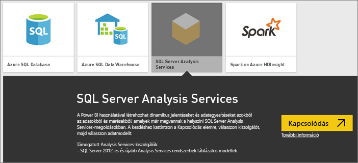
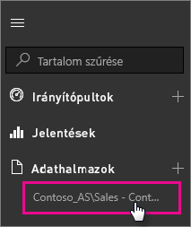

# Az SQL Server Analysis Services élő adatai a Power BI-ban
A Power BI szolgáltatásban kétféleképpen csatlakozhat egy SQL Server Analysis Services-kiszolgálóhoz. Az **Adatok lekérése** lehetőséggel csatlakozhat egy SQL Server Analysis Services-kiszolgálóhoz, vagy egy [Power BI Desktop-fájlhoz](service-desktop-files.md), vagy egy olyan [Excel-munkafüzethez](service-excel-workbook-files.md), amely már csatlakozik egy Analysis Services-kiszolgálóhoz. Ajánlott eljárásként a Microsoft a Power BI Desktop használatát javasolja az ott elérhető gazdag eszközkészlet miatt, illetve mert könnyedén tárolhat helyben biztonsági másolatokat a Power BI Desktop-fájlról.

 >[!IMPORTANT]
 >* Egy élő Analysis Services-kiszolgálóhoz való csatlakozáshoz egy rendszergazdának egy helyszíni adatátjárót kell telepítenie és konfigurálnia. További információ: [Helyszíni adatátjáró](service-gateway-onprem.md).
 >* Az átjáró használatakor az adatok a helyszínen maradnak.  Az adatok alapján létrehozott jelentéseket menti a Power BI szolgáltatás. 
 >* [A Q&A természetes nyelvű lekérdezés](service-q-and-a-direct-query.md) jelenleg előzetes verzióban érhető el az Analysis Services élő kapcsolataihoz.

## Csatlakozás egy modellhez az Adatok lekérése funkcióval
1. A **Saját munkaterületen** válassza az**Adatok lekérése** lehetőséget. Amennyiben elérhető, egy csoportos munkaterületre is válthat.
   
   
2. Válassza az **Adatbázisok és továbbiak** lehetőséget.
   
   
3. Válassza az **SQL Server Analysis Services** > **Csatlakozás** lehetőséget. 
   
   
4. Válasszon egy kiszolgálót. Ha nem lát egy kiszolgálót sem, akkor vagy egy átjáró vagy egy adatforrás nincs konfigurálva, vagy a fiókja nem szerepel az adatforrás **Felhasználók** lapján az átjáróban. Kérje a rendszergazda segítségét.
5. Válassza ki, melyik modellhez szeretne csatlakozni. Ez lehet egy táblázatos vagy többdimenziós típus.

Miután csatlakozott a modellhez, az megjelenik a saját Power BI-webhelyén a **Saját munkaterület/Adatkészletek** területen. Ha csoportos munkaterületre váltott, az adatkészlet a csoporton belül jelenik meg.

## Irányítópult csempéi
Ha vizualizációkat rögzít egy jelentésből az irányítópultra, a rögzített csempék 10 percenként automatikusan frissülnek. Ha frissülnek a helyszíni Analysis Services-adatok, a csempék 10 perc elteltével automatikusan frissülnek.

## Következő lépések
[Helyszíni adatátjáró](service-gateway-onprem.md)  
[Az Analysis Services adatforrásainak kezelése](service-gateway-enterprise-manage-ssas.md)  
[A Helyszíni adatátjáróval kapcsolatos hibák elhárítása](service-gateway-onprem-tshoot.md)  
További kérdései vannak? [Kérdezze meg a Power BI közösségét](http://community.powerbi.com/)

